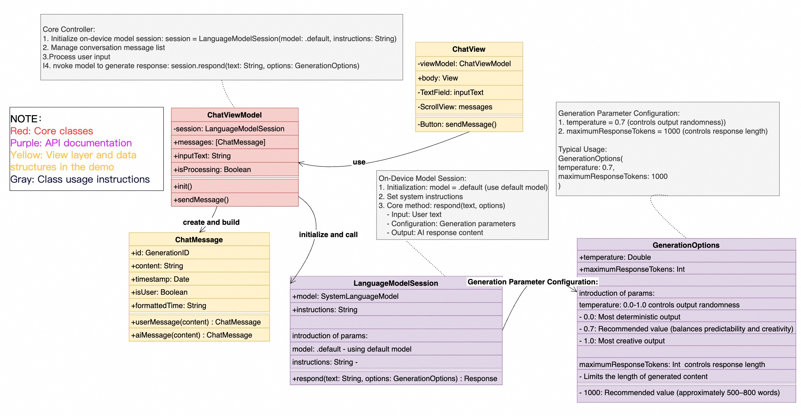

# iOS26-LLM-Demo-Chatbot
iOS 26 On-Device LLM Demo Implementation – Chatbot

This project demonstrates a local large language model (LLM) chat interface built using **iOS 26 system-level LLM APIs** (e.g., `SystemLanguageModel`, `LanguageModelSession`). Users can interact with a local AI model directly on their device without cloud dependency.

---

## ⚠️ Prerequisites

❗️ **All conditions must be met**:
1. **Device**: US-market iPhone (confirmed to work)
2. **OS**: iOS 26 system (not compatible with older versions)
3. **Xcode**: Version 16 (or higher)
4. **Important Note**: 
   - Hong Kong-market iPhones are **not supported** (API returns "unavailable")
   - No need for a physical SIM card, but Apple ID region must be set to the US

---

## ✅ What You'll Get

- A working chat interface that communicates with the local LLM engine
- Demonstration of iOS 26's `LanguageModelSession` and `SystemLanguageModel` capabilities
- Foundation for building advanced on-device AI applications

---

## 📄 Main Class Overview

🚩ChatViewModel.swift : 
  Purpose: Core component for managing LLM conversation sessions

  Key Properties:
    Initializes on-device model session
     - Uses LanguageModelSession to create a local model session
     - Configures generation parameters via GenerationOptions
  
    Manages conversation message list
     - Maintains the state of chat history and response data
   
    Processes user input
     - Accepts user input text (inputText) as model input parameter
  
    Generates model responses
     - Invokes respond() method to retrieve model-generated replies
     - Handles asynchronous response streaming and completion

🚩ChatMessage.swift:
  Purpose: Defines the core data structure for chat messages
  Key Properties:
    content: Stores the actual text of the message
    sender: Enum type distinguishing user input vs AI response
    timestamp: Records when the message was created

🚩ChatView.swift
  Functionality:
    Implements the visual layout for chat interface
    Binds to ChatViewModel for data flow
    Contains input field and send button components
    Displays chat history via MessageBubble views

